DS 202 - Project Proposal
================
Save Gaza
03-29-2024

## Analysis of agricultural economics statistics in the US

We want to analyze the agricultural economics statistics in the US. We
are using [real world data](https://www.nass.usda.gov/datasets/) from
the USDA NASS. Our specific dataset is `qs.economics_20240329.gz`

## Team Members

Hazer Becic, Ashraf Shaikh Mohammed, Luis Hinkhouse, Mohamed Bashier,
Mazin Bashier.

## Data

Our data is present as a zipped txt file in tab separated format. It
appears the data is relatively clean on the first glance, so we assume
not much intensive data cleaning needs to be done.

There’s [accompanying
documentation](https://quickstats.nass.usda.gov/src/glossary.pdf) to
understand certain values in our dataset.

## Introduction

-   Agricultural economics statistics data set by the United States
    Department of Agriculture (USDA)

-   Used for economic analysis aimed at understanding trends and impacts
    regarding the agricultural sector

-   Data spans across multiple geographical levels, national, regional,
    and states with the United States.

-   In our data we have many variables that help us learn about what
    agricultural economic sectors are present in various states in the
    US as well as their growth/decline over the years.

<!-- -->

    ## [1] "qs.economics_20240507.txt.gz"

    ## [1] "https://www.nass.usda.gov/datasets/qs.economics_20240507.txt.gz"

    ## [1] 39

    ## [1] 11695887       39

    ##  [1] "SOURCE_DESC"           "SECTOR_DESC"           "GROUP_DESC"           
    ##  [4] "COMMODITY_DESC"        "CLASS_DESC"            "PRODN_PRACTICE_DESC"  
    ##  [7] "UTIL_PRACTICE_DESC"    "STATISTICCAT_DESC"     "UNIT_DESC"            
    ## [10] "SHORT_DESC"            "DOMAIN_DESC"           "DOMAINCAT_DESC"       
    ## [13] "AGG_LEVEL_DESC"        "STATE_ANSI"            "STATE_FIPS_CODE"      
    ## [16] "STATE_ALPHA"           "STATE_NAME"            "ASD_CODE"             
    ## [19] "ASD_DESC"              "COUNTY_ANSI"           "COUNTY_CODE"          
    ## [22] "COUNTY_NAME"           "REGION_DESC"           "ZIP_5"                
    ## [25] "WATERSHED_CODE"        "WATERSHED_DESC"        "CONGR_DISTRICT_CODE"  
    ## [28] "COUNTRY_CODE"          "COUNTRY_NAME"          "LOCATION_DESC"        
    ## [31] "YEAR"                  "FREQ_DESC"             "BEGIN_CODE"           
    ## [34] "END_CODE"              "REFERENCE_PERIOD_DESC" "WEEK_ENDING"          
    ## [37] "LOAD_TIME"             "VALUE"                 "CV_."

We see we have 39 columns containing lots of valuable information.-

# Questions to be addressed

## Agricultural land area operations

### Question:

How much effort do farmers put into helping crop harvesting?

### Objective:

-   Area of cropland harvested without human intervention vs area of
    cropland harvested after human intervention.

-   Change over the years

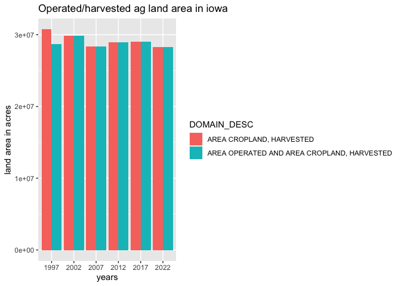<!-- -->

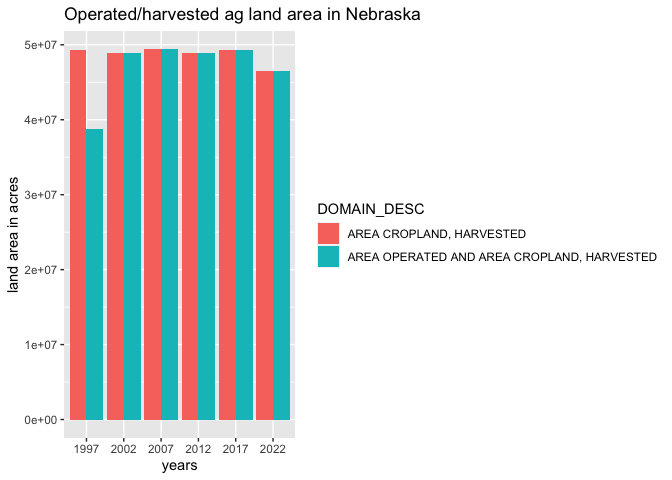<!-- -->

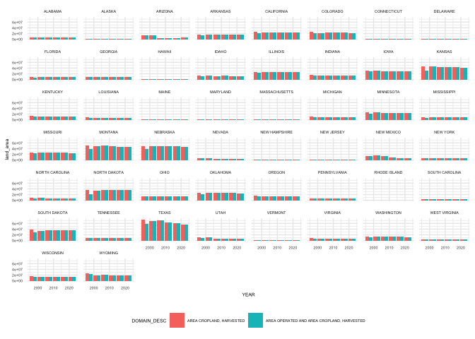<!-- -->

### Analysis:

-   Downward trend of natural harvest over the years - Texas

-   Upward trend of operational harvest over the years (in comparison to
    natural) - North Dakota

#### Stuff that we may learn from this

-   Nature changes - like less rain

-   Extreme but maybe evolving species (weeds, bugs)

-   California, Texas, Iowa, Delaware sizes to cropland ratio.

## Financial Operational Efficiency for 2009

### Question:

“What are the trends in financial operational efficiency for the
business operations across all sectors in the US?”

### Background:

We have data only for 2009 for this metric in our dataset. Energy
finances is an important metric to measure efficiency of operations for
businesses.

### Objective:

To examine the national trends in energy expenses and savings as it
relates to `dollars per operations` and identify states where businesses
need to focus on optimizing their operations.

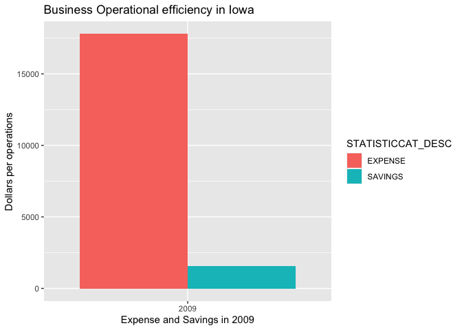<!-- -->

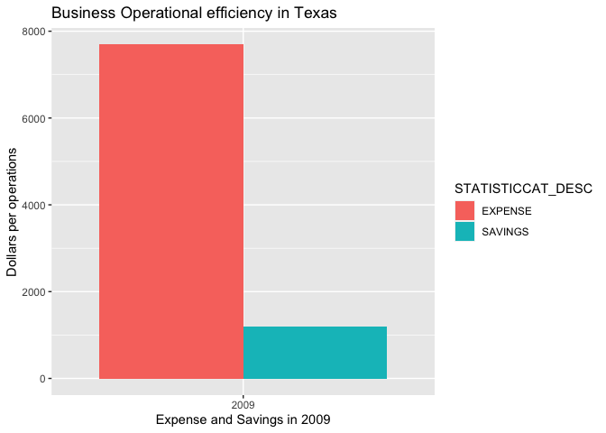<!-- -->

### Iowa VS Texas

-   Iowa spends more dollars per operations than Texas.

-   Iowa and Texas both have similar savings in dollars per operations

-   Texas thus has more operational efficiency than Iowa.

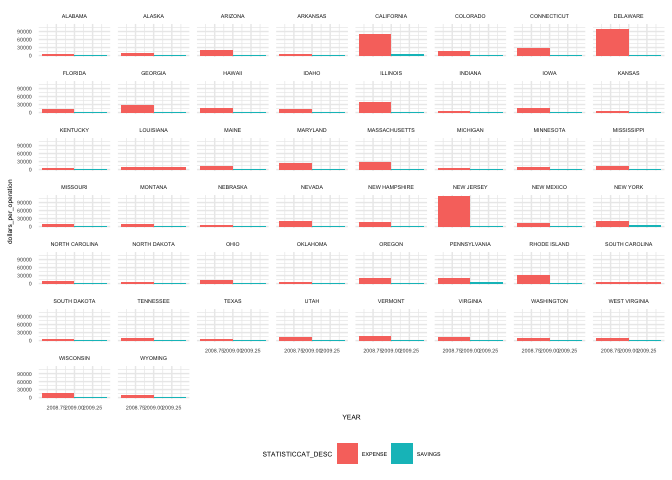<!-- -->

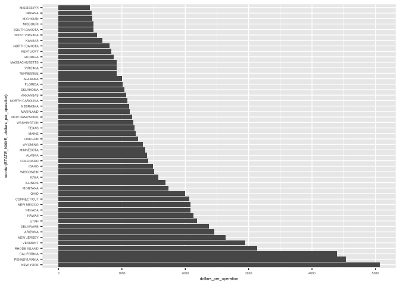<!-- -->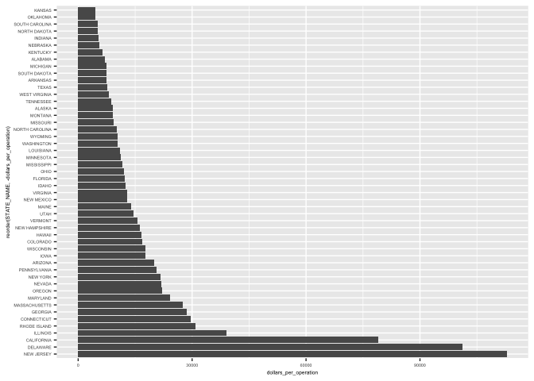<!-- -->

### Analysis for 50 states

-   Louisiana is an outlier. Has no savings in 2009.

-   Delaware and New Jersey have very inefficient operations for smaller
    states.

-   Potential opportunities for innovation in such states.

-   New Jersey has the largest expenditure.

-   New York has the largest savings.

## Cattle Production

This data reveals the average revenue from cattle sales,shaped by market
demand, pricing strategies, and economic factors. It highlights how
external changes impact profitability, guiding decisions to optimize the
cattle industry.

### Background:

Cattle production plays a critical role in the U.S. agricultural sector,
contributing significantly to the national economy. Analyzing the trends
in production values over the years can provide insights into the
economic health of this sector, impacts of market changes, and potential
effects of agricultural policies.

### Objective:

To examine the national trends in cattle production values over the
years, identifying periods of growth or decline that may correlate with
external factors such as market dynamics, policy changes, or other
economic conditions.

I chose this type of graph because it is easier to read the data from.
It does not consider inflation since it not in the data and part of the
production value.

    ## # A tibble: 1 × 2
    ##   STATE_NAME Average_Value
    ##   <chr>              <dbl>
    ## 1 US TOTAL            109.

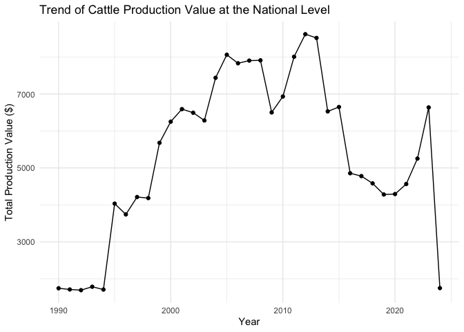<!-- -->

## Overall expenses

### Question

How does the distribution of agricultural expenses vary across different
states in the United States over the years?

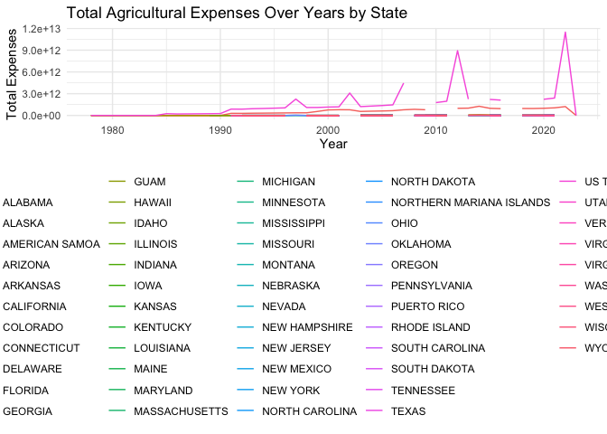<!-- --><!-- -->

    ## # A tibble: 16 × 3
    ##    STATE_NAME GROUP_DESC            Total_Expenses
    ##    <chr>      <chr>                          <dbl>
    ##  1 VIRGINIA   FARMS & LAND & ASSETS        1.74e12
    ##  2 VIRGINIA   INCOME                       4.49e11
    ##  3 VIRGINIA   EXPENSES                     3.30e11
    ##  4 VIRGINIA   IRRIGATION                   2.09e 8
    ##  5 VIRGINIA   ENERGY                       9.04e 4
    ##  6 WISCONSIN  FARMS & LAND & ASSETS        3.64e12
    ##  7 WISCONSIN  INCOME                       1.30e12
    ##  8 WISCONSIN  EXPENSES                     1.28e12
    ##  9 WISCONSIN  IRRIGATION                   4.09e 8
    ## 10 WISCONSIN  ENERGY                       1.75e 6
    ## 11 WYOMING    FARMS & LAND & ASSETS        1.10e12
    ## 12 WYOMING    INCOME                       1.68e11
    ## 13 WYOMING    EXPENSES                     1.37e11
    ## 14 WYOMING    IRRIGATION                   3.87e 8
    ## 15 WYOMING    ENERGY                       6.21e 4
    ## 16 WYOMING    PRICES PAID                  2.04e 3

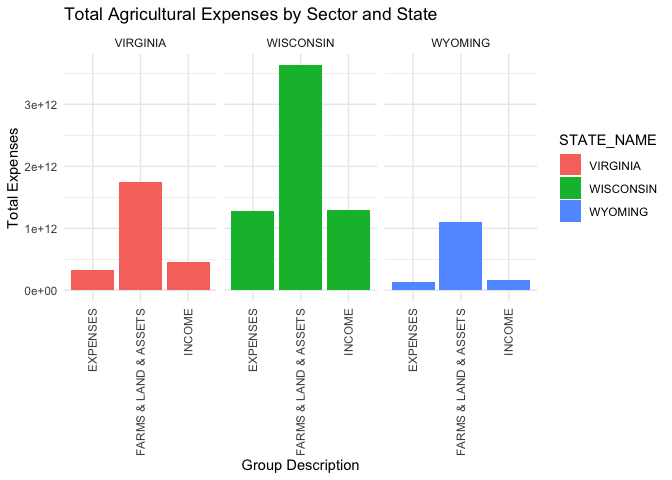<!-- -->

### First graph

In this first graph we can see that Virginia had the highest expenses in
each decade.

With Wyoming and Wisconsin also among the states with the highest
expenses. No other state came close to the total agricultural expenses
as these three states.

### Second graph

In the second graph We wanted to analyze which sectors are associated
with higher total expenses. To do this we counted the mean number of
times each unique sector came up and then filtered by the top five. We
wanted to see if there was an association between these sectors and the
top three states that we selected. Farms & Lands & Assets had the
highest total expenses for these states. Followed by Income and then
expenses Those 3 sectors are associated with higher total expenses.
However, these states didn’t have any values for the other two sectors
provided in the graph. This is due to a variety of reasons including
climate/geography, market demand, and government policy.

## Trends in Agricultural Production: A Historical Analysis

### Potential Reasons:

Introduction of high-yield crop varieties, chemical fertilizers, and
advanced farming methods have all played crucial roles in increasing
productivity.

### Future Benefits:

By studying these changes, policymakers, researchers, and stakeholders
can better understand the pressures on agricultural systems and make
informed decisions that balance productivity with sustainability and
economic viability.

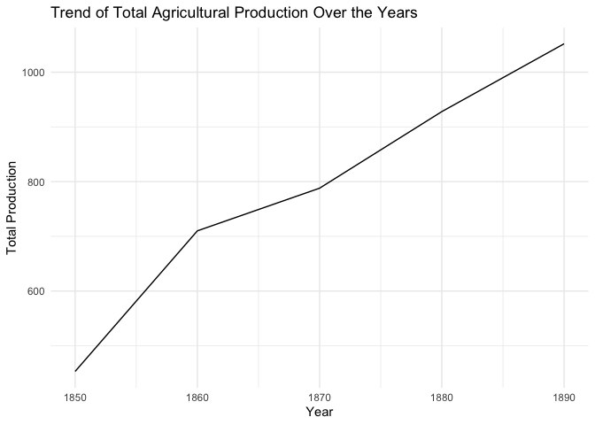<!-- -->

As shown from the figure, there is a quite obvious increase in
production as the years have gone by. As obvious, there is going to be a
slow start as agricultural practices, technological advances, and
farming practices were not as popular. We can even presume that it was
very low to the point agriculture was barely economically beneficial. As
the years go by, new methods, technologies, and practices are
introduced, so that explains the rapid incline of total agricultural
production.

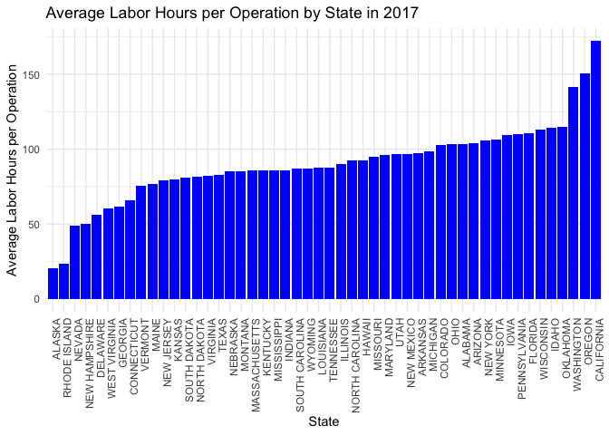<!-- -->

When looking at the different states of the United States, a question
that would be interesting to know is how different the average values of
labor operations differ across the,. In our case, we are looking at the
year 2017 specifically. Here, we want to see which states show proof of
the highest labor hours per operation throughout that year. From the
results, we can see that California has the highest average labor hours
per operation, which seems reasonable. There are different factors that
affect these labor hours, like the type of crops grown, the geographical
location, and the variety of high-grown crops. On the opposite side of
the graph, we can see that Alaska has the least average labor hours per
operation, which makes sense. Due to the cold weather, agricultural
practices are barely performed as it would be hard. In conclusion, this
graph helps show which states have the highest average labor hours
operations versus the lowest, ranking them in order.
